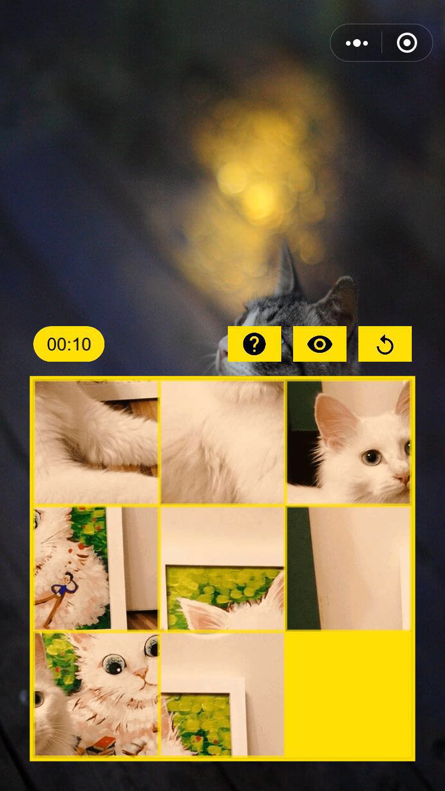

# 趣味滑块拼图 小游戏

## 简介

一个微信小程序游戏，滑动进行方块拼接




### 版本功能记录

#### 1.0.1 / 开发计划
```
分享成绩
  分享我的成绩到好友和朋友圈，求虐
登录
  用户授权登录
  通过后时候公开成绩
排行榜
  显示好友榜以及全员榜
换图片
  可以上传自己喜欢的图片来拼图
```

#### 1.0.0
```
配置
  图片取自云开发数据库
难度
  三个梯度3x3、4X4、5x5
优化页面显示
滑动拼图功能
```

## 源码目录介绍

``` text
./js
├── base                                   // 定义游戏开发基础类
│   ├── button.js                          // 游戏内可点击图片类
│   └── eventUtil.js                       // 处理点击事件的类
├── libs
│   ├── bezier.js                          // 用于进行淡入淡出动画的类库 https://github.com/gre/bezier-easing
│   ├── symbol.js                          // ES6 Symbol简易兼容
│   └── weapp-adapter.js                   // 小游戏适配器
├── models
│   └── piece.js                           // 拼图方块类
├── runtime
│   ├── background.js                      // 背景类
│   ├── gameInfo.js                        // 游戏菜单、按钮和分数
│   ├── gameMap.js                         // 用于提供游戏的随机地图
│   └── music.js                           // 全局音效管理器
├── databus.js                             // 管控游戏状态
└── main.js                                // 游戏入口主函数

```
